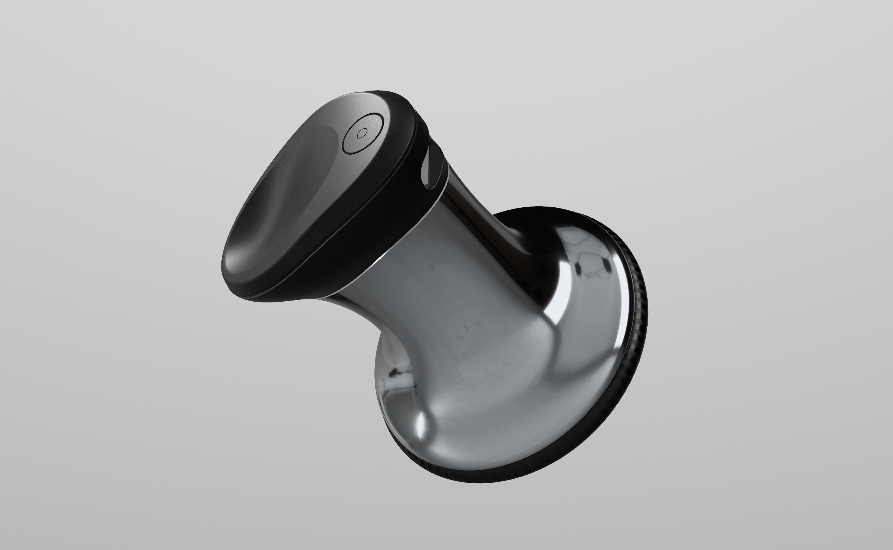
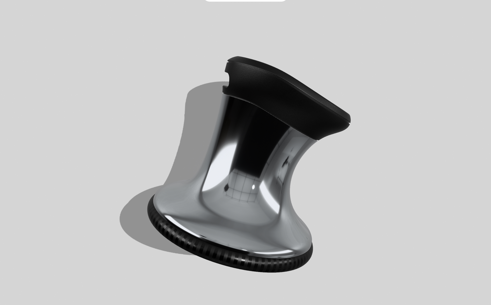
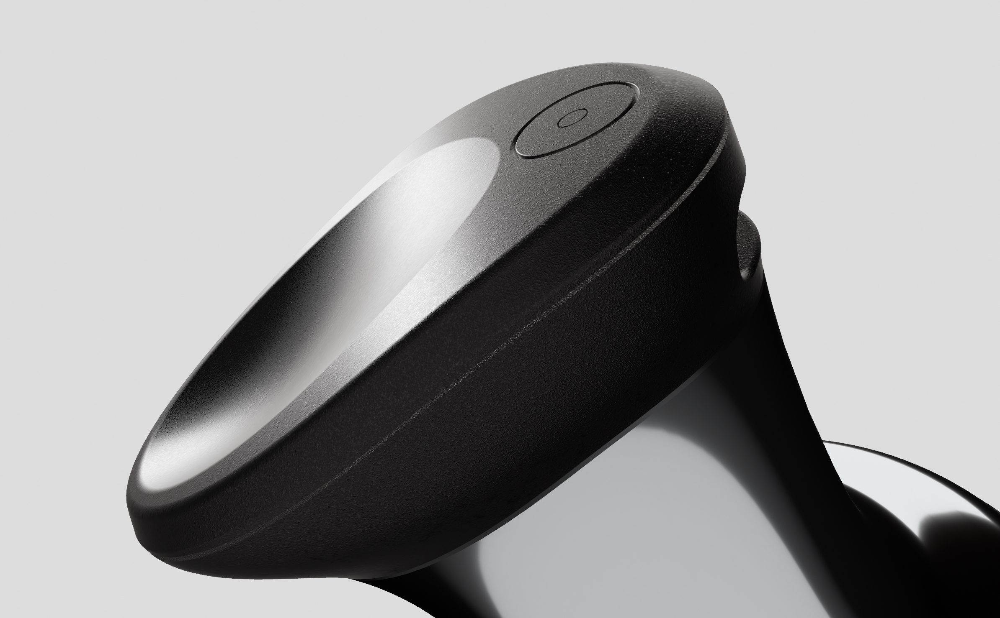
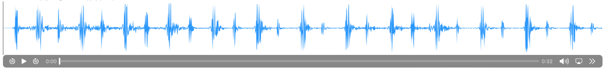
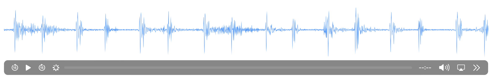
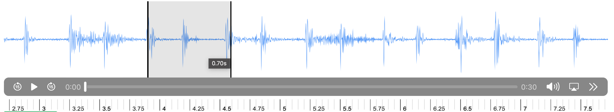



# Intelligent Stethoscope

My career aspiration revolves around utilizing technology to enhance the lives of individuals residing in remote areas. When the COVID-19 pandemic emerged in 2020, I recognized an opportunity to employ my coding expertise in a meaningful way. As my father, a dedicated doctor and esteemed medical professor, battled the pandemic on the front lines, I observed the challenges faced by healthcare professionals who couldn't utilize conventional stethoscopes while donning protective suits. This realization sparked a question within me: "Why not create a wireless stethoscope embedded with AI algorithms specifically designed for telemedicine applications?"

So I invented this intelligent Stethoscope:

This minimum viable product possesses the capability to diagnose ailments and securely store patients' information using our model and applications. As depicted in the waveform, every intricate detail of the heart sound is captured, thereby aiding doctors in comprehending the situation more effectively and facilitating precise judgment.

*The waveform exhibits numerous details, including S1 and S2, along with various elements that are imperceptible to the human ear.*

*It serves as a comprehensive visual representation, enabling healthcare professionals to discern intricate nuances and abnormalities in the heart sound that would otherwise go unnoticed.*

Also, there are many amazing functions I will develop in the future, like auto heart rate detection. 

Furthermore, my vision encompasses integrating LLM (Large Language Model) technologies with multimodality to establish a comprehensive intelligent mechanism that provides extensive support to healthcare professionals. **In pursuit of this goal, I am actively seeking a team comprising individuals who are self-motivated and passionate. If you possess experience or a keen interest in this field, I would be delighted to engage in discussions regarding its future prospects and explore potential collaborations with you.**

